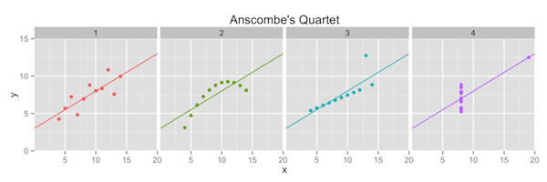

Anscombe's Quartet
==============================



Slides
------------------------------

- [Anscombe's Quartet](https://drive.google.com/file/d/0BxYofk0iB_upanNETXU2RVZlSmc/edit?usp=sharing)

Source
------------------------------

- [`anscombe.r`](anscombe.r)
  
  To run this file in R, make sure you have the `devtools` package installed and run the following commands:

  ```
  library(devtools)
  source_url("https://raw.github.com/msan622/lectures/master/Anscombe's%20Quartet/anscombe.r")
  ```

References
------------------------------

- [Anscombe's Quartet (Wikipedia)](http://en.wikipedia.org/wiki/Anscombe's_quartet)
- [The Visual Difference – R and Anscombe’s Quartet](http://blog.ouseful.info/2011/08/30/the-visual-difference-%E2%80%93-r-and-anscombe%E2%80%99s-quartet/)
