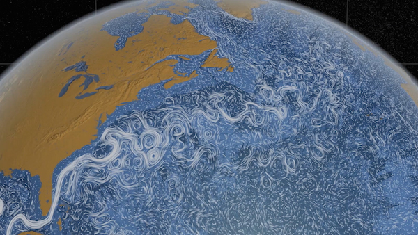

Dimensionality
==============================

Slides
------------------------------

- [Dimensionality](https://drive.google.com/file/d/0BxYofk0iB_upNkxKUC1CM3F2c00/edit?usp=sharing)

Videos
------------------------------

- [Stunning Data Visualization in the AlloSphere by JoAnn Kuchera-Morin](http://www.ted.com/talks/joann_kuchera_morin_tours_the_allosphere)
- [A 3D Atlas of the Universe by Carter Emmart](http://www.ted.com/talks/carter_emmart_demos_a_3d_atlas_of_the_universe)

- [Perpetual Ocean](http://svs.gsfc.nasa.gov/vis/a010000/a010800/a010841/index.html)
- [KeckCAVES at UC Davis](http://csc.ucdavis.edu/~chaos/chaos/pubs/esa.htm)

References
------------------------------

Please see the links provided in the slides for references and resources.
