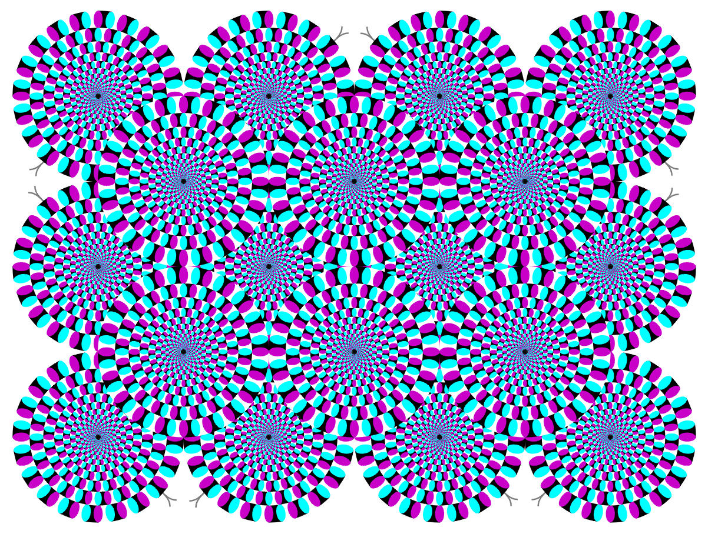

Perception
==============================

  
Image from <http://www.ritsumei.ac.jp/~akitaoka/rotsnakee.html>. See [The Rotating Snakes Are All In Your Mind](http://www.npr.org/blogs/13.7/2014/03/24/293740555/the-rotating-snakes-are-all-in-your-mind) from NPR for a recent article on this illusion.

Slides
------------------------------

- [Perception](https://drive.google.com/file/d/0BxYofk0iB_upREVRSWFNRHlEcEE/edit?usp=sharing)
- [Optical Illusions](https://drive.google.com/file/d/0BxYofk0iB_upc0xCb2ptR3MzQ2c/edit?usp=sharing)

Videos
------------------------------

- [TED Talk: Optical Illusions Show How We See by Beau Lotto](http://www.ted.com/talks/beau_lotto_optical_illusions_show_how_we_see)

References
------------------------------

Please see the links provided in the slides for references and resources.
