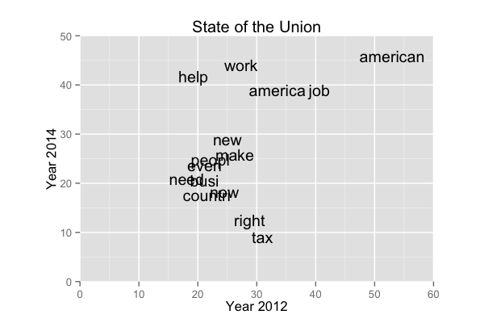

Text Data Visualization
==============================

Slides
------------------------------

- [Text Data Visualization](https://drive.google.com/file/d/0BxYofk0iB_upVmNwZmo5WkpHN1k/edit?usp=sharing)

Demos
------------------------------

- [`sotu.r`](sotu.r) demonstrates how to use the `tm` package to process a corpus of text
- [`barplot.r`](barplot.r) demonstrates how to create a bar plot in `ggplot2` based on the word frequencies from the `tm` package
- [`freqplot.r`](freqplot.r) demonstrates how to create a scatterplot to compare the difference of word frequencies between two text files
- [`wordcloud.r`](wordcloud.r) demonstrates how to create a word cloud using the `wordcloud` package

These examples assume you the `sotu` subdirectory in the current working directory with the transcripts of the latest State of the Union addresses.

References
------------------------------

Please see the links provided in the slides for references and resources.
