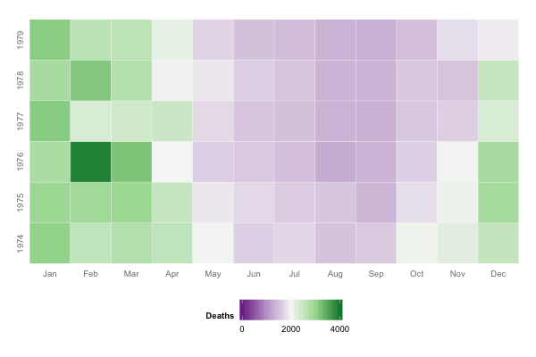

Time Series Visualization
==============================

Slides
------------------------------

- [Time Series Visualization]()

Demos
------------------------------

- [`basic/area.r`](basic/area.r)  
  Line and Stacked Area Plots

- [`basic/heat.r`](basic/heat.r)  
  Heatmap and Circle View

- [`basic/multi.r`](basic/multi.r)  
  Multi-Line and Star Plots

- [`basic/data.r`](basic/data.r)  
  Manipulating Time Series Data

- [`basic/pretty.r`](basic/pretty.r)  
  Scale and Theme Customization

- [`animated/*.r`](animated/)  
  Animated Time Series

References
------------------------------

Please see the links provided in the slides for references and resources.
